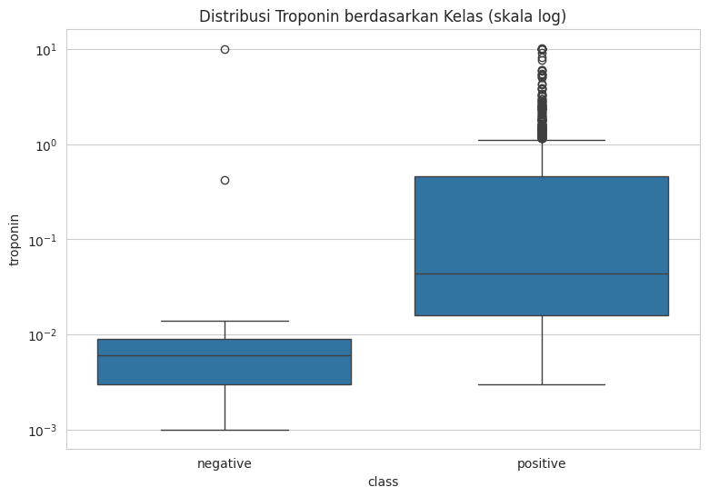
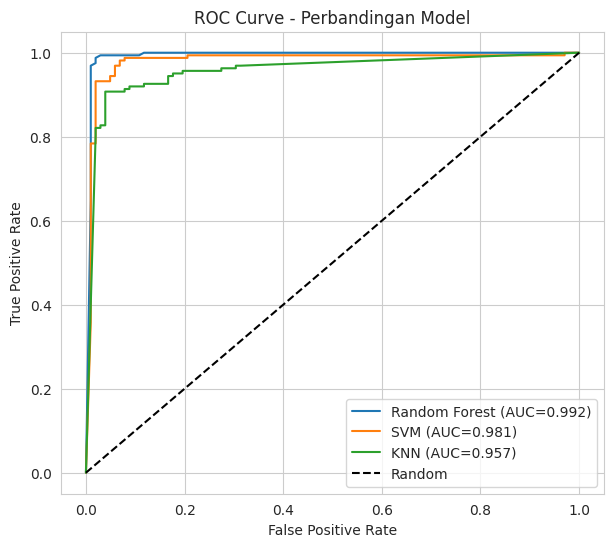
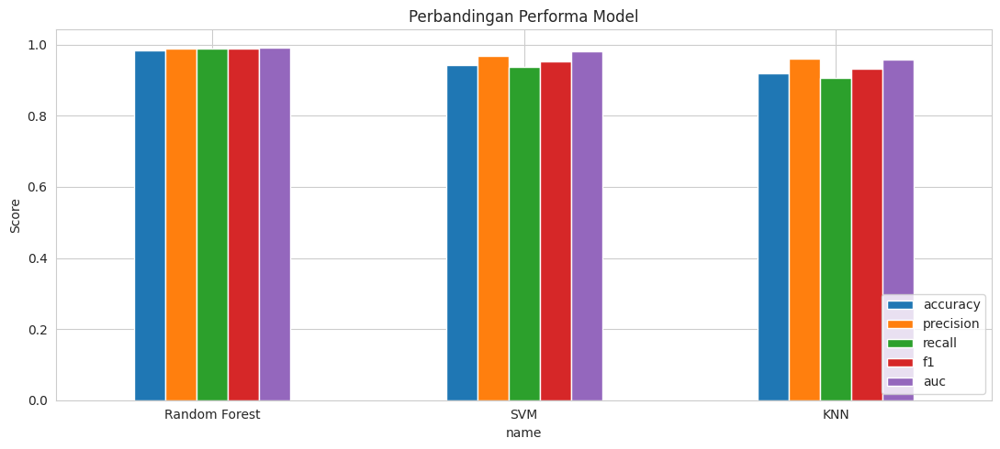
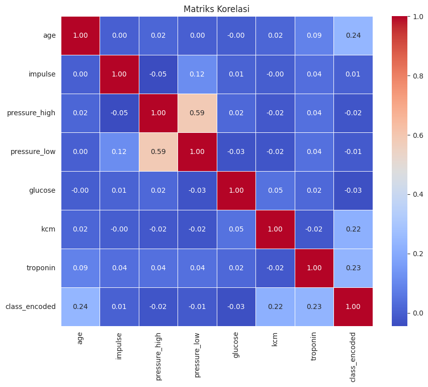

# Silent Signals: Troponin & CK-MB as the Strongest Heart Attack Risk Markers


> **View the visual summary & business impact on my [Portfolio Website ↗]([MASUKKAN_LINK_WEBSITE_PORTOPOLIO_KAMU_DISINI])**

## 📌 Clinical Business Problem
In emergency rooms, triage decisions for cardiac patients must be made quickly. However, complete lab results can take time. The objective of this project is to build a classification model to predict heart attack risk from clinical data (1,319 patients). 

The ultimate goal is to assist medical staff in prioritizing patients. Because missing a high-risk patient is fatal, this project deliberately prioritizes **Recall (minimizing False Negatives)** over standard accuracy.

## 🗂️ Data & Technical Methodology
**Rigorous Data Preparation:**
1. **Anomaly Handling:** Treated `impulse=1111` (a physiologically impossible heart rate) as a data entry error, utilizing median imputation to preserve the rest of the patient's valid data.
2. **Clinical Outliers:** Applied IQR capping for extreme biomarker values (e.g., CK-MB). Extreme values in medical data are often the most informative signals, so signal variation was retained rather than blindly deleted.
3. **Preventing Data Leakage:** Critically ensured all outlier bounds, scaling, and feature selection were computed *only* on training data and then applied to test data.

**Modeling Strategy:**
- Conducted independent *t-tests* (`SciPy`) to mathematically validate which features actually differentiate positive from negative classes.
- Used `SelectKBest` to isolate the top features.
- Applied `GridSearchCV` with `StratifiedKFold` to tune Random Forest, SVM, and KNN. The scoring metric was forced to optimize for **Recall**.

---

## 📊 Key Insights & Model Evaluation

### 1. Biomarkers Dwarf Vital Signs
Independent t-tests revealed a counter-intuitive finding for non-specialists: Blood pressure (p=0.450) and pulse rate (p=0.807)—metrics commonly associated with heart risk showed **no statistically significant difference** between classes. 

Instead, "silent" cardiac biomarkers (Troponin and CK-MB) completely dominate the prediction power. 


*(Insight: Troponin is the single strongest indicator. The distribution clearly separates positive vs negative patients).*

### 2. Model Performance: Random Forest Dominates
After rigorous cross-validation and hyperparameter tuning, the Random Forest model outperformed SVM and KNN. It achieved a staggering **98.77% Recall** and **99.25% ROC-AUC**. Out of 162 positive test cases, the model only missed 2.




*(Insight: Random Forest excels at handling the non-linear thresholds of clinical lab results compared to distance-based models like KNN).*

### 3. Correlation Heatmap
The heatmap confirms our t-test findings. Troponin and CK-MB show the strongest positive correlation with the target class, while vital signs show near-zero correlation.



---

## 💡 Clinical Recommendations
1. **Triage Prioritization:** Fast-track Troponin and CK-MB lab processing for patients exhibiting cardiac symptoms, as these are mathematically proven to be the strongest signals.
2. **Age as a Baseline Signal:** Age showed a highly significant p-value (1.86×10⁻¹⁸). Since age is immediately known at triage with zero cost, it should be weighted heavily before lab results arrive.
3. **Screening Tool Integration:** Deploy the model as an initial screening aid while waiting for physician confirmation. Its high recall ensures a safety net so at-risk patients do not slip through standard triage protocols.

## 📂 Repository Structure
```text
├── data/
│   └── heart_attack_dataset.csv       # Clinical patient records
├── images/                            # Evaluation metrics & EDA charts
├── notebooks/
│   └── heart_attack_classification.ipynb  # Statistical testing & Modeling pipeline
├── requirements.txt                   # Dependencies
└── README.md
```

## 🚀 How to Run
1. Clone this repository: `git clone https://github.com/Daaffaaisa/Heart-Attack-Classification.git`
2. Install dependencies: `pip install -r requirements.txt`
3. Run the Jupyter Notebook in the notebooks/ directory.
